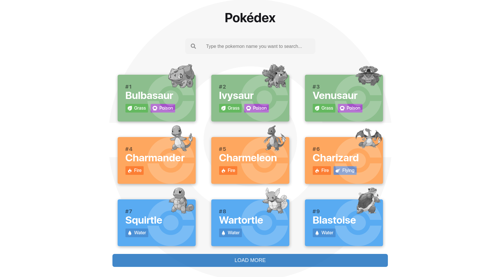

<h4 align="center">
  Pokedex
</h4>

<p align="center">
  <a href="#-project">Project</a>&nbsp;&nbsp;&nbsp;|&nbsp;&nbsp;&nbsp;
  <a href="#rocket-techs">Techs</a>&nbsp;&nbsp;&nbsp;|&nbsp;&nbsp;&nbsp;
  <a href="#rocket-Running">Running</a>&nbsp;&nbsp;&nbsp;|&nbsp;&nbsp;&nbsp;
</p>
<br>

## 💻 Project

 Inspired in the layout created by **[umpontoseis] (https://umpontoseis.com/)** I built this web application where you can find your favorite pokemon and see all about it.


## :rocket: Techs

- [Typescript](https://www.typescriptlang.org/)
- [Axios](https://www.npmjs.com/package/axios)
- [React Native](https://reactnative.dev/)
- [Expo](https://expo.io/)


## :notebook: Running

### Requeriments

```bash
# Clone this
$ git clone https://github.com/glauberbrack/react-pokedex

# Go to your project folder
$ cd react-pokedex

# Install all depencies
$ yarn install

# Run your project
$ yarn start
```

---

☕ Glauber Brack - <a href="mailto:glauber@brack.com.br?Subject=Hello%20you">Mail me!</a>
